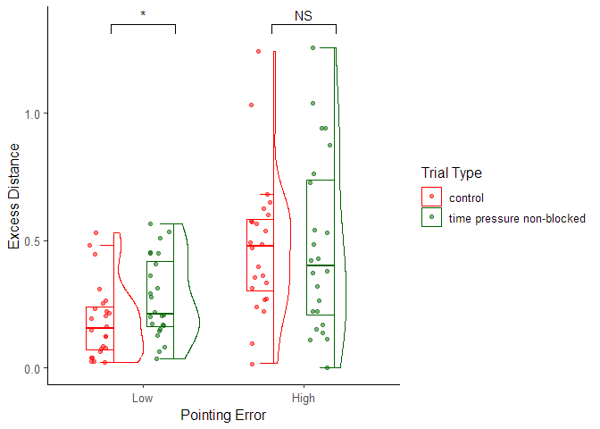

Analysis Notebook
================
Apurv Varshney

``` r
library(lme4)
library(effectsize)
library(lmerTest)
library(ggplot2)
library(svglite)
library(ggpubr)
library(car)
library(dplyr)
library(lmtest)
library(ordinal)
library(DAAG)
library(robustlmm)
library(moments)
library(gghalves)
library(apaTables)
library(MuMIn)
library(insight)
```

## Loading Data

``` r
data <- read.csv("data_wayfinding.csv")

data$trialType.f <- factor(data$trialType)
data$subject.f <- factor(data$subject)
data$trialID.f <- factor(data$trialID)
data$stress_level.s <- as.numeric(scale(data$stress_level))
data$success.f <- factor(data$success)
data$Efficiency.s <- as.numeric(scale(data$Efficiency))
data$speed.s <- as.numeric(scale(data$speed))
data$trial_type.int <- dplyr::recode(data$trialType.f, A=1, B=2, C=3)
data$trial_type.p <- dplyr::recode(data$trialType.f, A='control', B='time pressure non-blocked', C='time pressure blocked')

data_subj_success <- data[data$success==1, ] %>%
  group_by(subject.f) %>%
  summarise(Efficiency = mean(Efficiency))
```

``` r
data_si <- read.csv("SI_trial.csv")
data_si$trialType.f <- factor(data_si$trial_type)
data_si$subject.f <- factor(data_si$subject)
data_si$shortcut.f <- factor(data_si$shortcut)

data_with_si <- merge(data[data$success==1, ], data_si, by=c("subject.f","trialID"))

data_shortcut_subj <- data_with_si %>% 
  group_by(subject.f) %>% 
  summarise(shortcut = mean(shortcut))
```

``` r
data_other <- read.csv("data_questionnaire.csv")
data_other$subject.f <- factor(data_other$ID)

data_per_subj <- data %>% group_by(subject.f) %>% 
  summarise(stress_level = mean(stress_level),
            speed = mean(speed),
            success = mean(success))
data_per_subj <- merge(data_per_subj, data_subj_success, by=c("subject.f"))
data_per_subj <- merge(data_per_subj, data_shortcut_subj, by=c("subject.f"))

data_merge_per_subj <- merge(data_per_subj, data_other, by=c("subject.f"))
```

``` r
cbPalette <- c("red", "darkgreen", "darkblue")
data_b <- within(data, trialType.f <- relevel(trialType.f, ref = "B"))
data_subj <- data %>%
  group_by(subject.f, trialType.f, trial_type.p) %>%
  summarise(stress_level = mean(stress_level),
            speed = mean(speed),
            success = mean(success))
```

## Stress Rating

``` r
model <- lmer(stress_level.s ~ trialType.f + trialNumber + (1 | subject.f), data = data)
summary(model, ddf = "Satterthwaite")
```

    ## Linear mixed model fit by REML. t-tests use Satterthwaite's method [
    ## lmerModLmerTest]
    ## Formula: stress_level.s ~ trialType.f + trialNumber + (1 | subject.f)
    ##    Data: data
    ## 
    ## REML criterion at convergence: 2026.4
    ## 
    ## Scaled residuals: 
    ##     Min      1Q  Median      3Q     Max 
    ## -2.6912 -0.6564 -0.0181  0.5580  4.0117 
    ## 
    ## Random effects:
    ##  Groups    Name        Variance Std.Dev.
    ##  subject.f (Intercept) 0.3403   0.5833  
    ##  Residual              0.3063   0.5534  
    ## Number of obs: 1118, groups:  subject.f, 48
    ## 
    ## Fixed effects:
    ##                Estimate Std. Error         df t value Pr(>|t|)    
    ## (Intercept)  -3.478e-01  9.333e-02  6.568e+01  -3.727 0.000406 ***
    ## trialType.fB  8.110e-01  3.995e-02  1.067e+03  20.304  < 2e-16 ***
    ## trialType.fC  1.427e+00  4.178e-02  1.067e+03  34.153  < 2e-16 ***
    ## trialNumber  -1.369e-02  2.396e-03  1.067e+03  -5.714 1.43e-08 ***
    ## ---
    ## Signif. codes:  0 '***' 0.001 '**' 0.01 '*' 0.05 '.' 0.1 ' ' 1
    ## 
    ## Correlation of Fixed Effects:
    ##             (Intr) trlT.B trlT.C
    ## trialTyp.fB -0.158              
    ## trialTyp.fC -0.142  0.320       
    ## trialNumber -0.354  0.043  0.016

``` r
r.squaredGLMM(model)
```

    ##            R2m       R2c
    ## [1,] 0.3575919 0.6956869

``` r
model <- lmer(stress_level.s ~ trialType.f + trialNumber + (1 | subject.f), data = data_b)
summary(model, ddf = "Satterthwaite")
```

    ## Linear mixed model fit by REML. t-tests use Satterthwaite's method [
    ## lmerModLmerTest]
    ## Formula: stress_level.s ~ trialType.f + trialNumber + (1 | subject.f)
    ##    Data: data_b
    ## 
    ## REML criterion at convergence: 2026.4
    ## 
    ## Scaled residuals: 
    ##     Min      1Q  Median      3Q     Max 
    ## -2.6912 -0.6564 -0.0181  0.5580  4.0117 
    ## 
    ## Random effects:
    ##  Groups    Name        Variance Std.Dev.
    ##  subject.f (Intercept) 0.3403   0.5833  
    ##  Residual              0.3063   0.5534  
    ## Number of obs: 1118, groups:  subject.f, 48
    ## 
    ## Fixed effects:
    ##                Estimate Std. Error         df t value Pr(>|t|)    
    ## (Intercept)   4.632e-01  9.553e-02  7.203e+01   4.849 6.95e-06 ***
    ## trialType.fA -8.110e-01  3.995e-02  1.067e+03 -20.304  < 2e-16 ***
    ## trialType.fC  6.159e-01  4.768e-02  1.067e+03  12.917  < 2e-16 ***
    ## trialNumber  -1.369e-02  2.396e-03  1.067e+03  -5.714 1.43e-08 ***
    ## ---
    ## Signif. codes:  0 '***' 0.001 '**' 0.01 '*' 0.05 '.' 0.1 ' ' 1
    ## 
    ## Correlation of Fixed Effects:
    ##             (Intr) trlT.A trlT.C
    ## trialTyp.fA -0.264              
    ## trialTyp.fC -0.226  0.557       
    ## trialNumber -0.327 -0.043 -0.022

``` r
stress <- ggplot(data = data_subj, aes(x=trial_type.p, y=stress_level, shape=trial_type.p)) + geom_half_boxplot(errorbar.draw = TRUE, outlier.color = NA, data=data_subj, aes(x=trial_type.p, y=stress_level, color=trial_type.p)) + geom_half_violin(side = "r", data=data_subj, aes(x=trial_type.p, y=stress_level, color=trial_type.p)) + geom_half_point(side = "l", alpha = .5, data=data_subj, aes(x=trial_type.p, y=stress_level, color=trial_type.p)) + geom_signif(comparisons = list(c("control","time pressure non-blocked"),c("control","time pressure blocked"),c("time pressure non-blocked","time pressure blocked")), annotations = c("***","***","***"), y_position = c(7.6,7,7.6)) + theme_classic() + theme(legend.position="none", axis.text.x = element_text(size = 11, hjust = 0.5)) + scale_y_continuous(name ="Self-reported Stress Level", breaks=seq(0,7,1)) + scale_x_discrete(name="Trial Type") + scale_color_manual(values=cbPalette)
stress
```

<!-- -->

## Excess Distance

``` r
model <- lmer(Efficiency.s ~ trialType.f + trialNumber + (1 | subject.f), data = data[data$success==1,])
```

``` r
model <- rlmer(Efficiency.s ~ trialType.f + trialNumber + (1 | subject.f), data = data[data$success == 1,])
summary(model)
```

    ## Robust linear mixed model fit by DAStau 
    ## Formula: Efficiency.s ~ trialType.f + trialNumber + (1 | subject.f) 
    ##    Data: data[data$success == 1, ] 
    ## 
    ## Scaled residuals: 
    ##     Min      1Q  Median      3Q     Max 
    ## -2.3742 -0.5921 -0.2638  0.5842 18.7660 
    ## 
    ## Random effects:
    ##  Groups    Name        Variance Std.Dev.
    ##  subject.f (Intercept) 0.04271  0.2067  
    ##  Residual              0.24622  0.4962  
    ## Number of obs: 1043, groups: subject.f, 48
    ## 
    ## Fixed effects:
    ##               Estimate Std. Error t value
    ## (Intercept)  -0.230915   0.049108  -4.702
    ## trialType.fB  0.126165   0.037929   3.326
    ## trialType.fC -0.095363   0.041047  -2.323
    ## trialNumber  -0.006072   0.002310  -2.628
    ## 
    ## Correlation of Fixed Effects:
    ##             (Intr) trlT.B trlT.C
    ## trialTyp.fB -0.264              
    ## trialTyp.fC -0.218  0.302       
    ## trialNumber -0.648  0.024 -0.019
    ## 
    ## Robustness weights for the residuals: 
    ##  837 weights are ~= 1. The remaining 206 ones are summarized as
    ##    Min. 1st Qu.  Median    Mean 3rd Qu.    Max. 
    ##  0.0717  0.3290  0.5090  0.5530  0.7820  0.9990 
    ## 
    ## Robustness weights for the random effects: 
    ##  42 weights are ~= 1. The remaining 6 ones are
    ##    13    16    18    19    23    38 
    ## 0.450 0.790 0.423 0.734 0.488 0.333 
    ## 
    ## Rho functions used for fitting:
    ##   Residuals:
    ##     eff: smoothed Huber (k = 1.345, s = 10) 
    ##     sig: smoothed Huber, Proposal 2 (k = 1.345, s = 10) 
    ##   Random Effects, variance component 1 (subject.f):
    ##     eff: smoothed Huber (k = 1.345, s = 10) 
    ##     vcp: smoothed Huber, Proposal 2 (k = 1.345, s = 10)

``` r
var.fix <- get_variance_fixed(model)
var.ran <- get_variance_random(model)
var.res <- get_variance_residual(model)
R2m = var.fix/(var.fix+var.ran+var.res)
R2c = (var.fix+var.ran)/(var.fix+var.ran+var.res)
print(R2m)
```

    ##  var.fixed 
    ## 0.02623171

``` r
print(R2c)
```

    ## var.fixed 
    ## 0.1701731

``` r
model <- rlmer(Efficiency.s ~ trialType.f + trialNumber + (1 | subject.f), data = data_b[data_b$success == 1,])
summary(model)
```

    ## Robust linear mixed model fit by DAStau 
    ## Formula: Efficiency.s ~ trialType.f + trialNumber + (1 | subject.f) 
    ##    Data: data_b[data_b$success == 1, ] 
    ## 
    ## Scaled residuals: 
    ##     Min      1Q  Median      3Q     Max 
    ## -2.3742 -0.5921 -0.2638  0.5842 18.7660 
    ## 
    ## Random effects:
    ##  Groups    Name        Variance Std.Dev.
    ##  subject.f (Intercept) 0.04271  0.2067  
    ##  Residual              0.24622  0.4962  
    ## Number of obs: 1043, groups: subject.f, 48
    ## 
    ## Fixed effects:
    ##               Estimate Std. Error t value
    ## (Intercept)  -0.104750   0.053529  -1.957
    ## trialType.fA -0.126165   0.037929  -3.326
    ## trialType.fC -0.221528   0.046725  -4.741
    ## trialNumber  -0.006072   0.002310  -2.628
    ## 
    ## Correlation of Fixed Effects:
    ##             (Intr) trlT.A trlT.C
    ## trialTyp.fA -0.466              
    ## trialTyp.fC -0.366  0.546       
    ## trialNumber -0.577 -0.024 -0.036
    ## 
    ## Robustness weights for the residuals: 
    ##  837 weights are ~= 1. The remaining 206 ones are summarized as
    ##    Min. 1st Qu.  Median    Mean 3rd Qu.    Max. 
    ##  0.0717  0.3290  0.5090  0.5530  0.7820  0.9990 
    ## 
    ## Robustness weights for the random effects: 
    ##  42 weights are ~= 1. The remaining 6 ones are
    ##    13    16    18    19    23    38 
    ## 0.450 0.790 0.423 0.734 0.488 0.333 
    ## 
    ## Rho functions used for fitting:
    ##   Residuals:
    ##     eff: smoothed Huber (k = 1.345, s = 10) 
    ##     sig: smoothed Huber, Proposal 2 (k = 1.345, s = 10) 
    ##   Random Effects, variance component 1 (subject.f):
    ##     eff: smoothed Huber (k = 1.345, s = 10) 
    ##     vcp: smoothed Huber, Proposal 2 (k = 1.345, s = 10)

``` r
model <- lmer(Efficiency.s ~ trialType.f + trialNumber + (1 | subject.f), data = data[data$success == 1,])

robust_model <- rlmer(Efficiency.s ~ trialType.f + trialNumber + (1 | subject.f), data = data[data$success == 1,])

# get coefficients from non-robust model to extract Satterthwaite approximated DFs
coefs <- data.frame(coef(summary(model)))

# get coefficients from robust model to extract t-values
coefs.robust <- coef(summary(robust_model))

# calculate p-values based on robust t-values and non-robust approx. DFs
p.values <- 2*pt(abs(coefs.robust[,3]), coefs$df, lower=FALSE)
p.values < 0.05
```

    ##  (Intercept) trialType.fB trialType.fC  trialNumber 
    ##         TRUE         TRUE         TRUE         TRUE

``` r
p.values < 0.01
```

    ##  (Intercept) trialType.fB trialType.fC  trialNumber 
    ##         TRUE         TRUE        FALSE         TRUE

``` r
p.values < 0.001
```

    ##  (Intercept) trialType.fB trialType.fC  trialNumber 
    ##         TRUE         TRUE        FALSE        FALSE

``` r
p.values
```

    ##  (Intercept) trialType.fB trialType.fC  trialNumber 
    ## 5.090279e-06 9.123337e-04 2.036589e-02 8.709625e-03

``` r
model <- lmer(Efficiency.s ~ trialType.f + trialNumber + (1 | subject.f), data = data_b[data_b$success == 1,])

robust_model <- rlmer(Efficiency.s ~ trialType.f + trialNumber + (1 | subject.f), data = data_b[data_b$success == 1,])

# get coefficients from non-robust model to extract Satterthwaite approximated DFs
coefs <- data.frame(coef(summary(model)))

# get coefficients from robust model to extract t-values
coefs.robust <- coef(summary(robust_model))

# calculate p-values based on robust t-values and non-robust approx. DFs
p.values <- 2*pt(abs(coefs.robust[,3]), coefs$df, lower=FALSE)
p.values < 0.05
```

    ##  (Intercept) trialType.fA trialType.fC  trialNumber 
    ##        FALSE         TRUE         TRUE         TRUE

``` r
p.values < 0.01
```

    ##  (Intercept) trialType.fA trialType.fC  trialNumber 
    ##        FALSE         TRUE         TRUE         TRUE

``` r
p.values < 0.001
```

    ##  (Intercept) trialType.fA trialType.fC  trialNumber 
    ##        FALSE         TRUE         TRUE        FALSE

``` r
p.values
```

    ##  (Intercept) trialType.fA trialType.fC  trialNumber 
    ## 5.149490e-02 9.123337e-04 2.436551e-06 8.709625e-03

``` r
data_subj_trial_success <- data[data$success==1,] %>%
  group_by(subject.f, trialType.f, trial_type.p) %>%
  summarise(Efficiency = mean(Efficiency))
```

    ## `summarise()` has grouped output by 'subject.f', 'trialType.f'. You can
    ## override using the `.groups` argument.

``` r
eff <- ggplot(data = data_subj_trial_success, aes(x=trial_type.p, y=Efficiency, shape=trial_type.p)) + geom_half_boxplot(errorbar.draw = TRUE, outlier.color = NA, data=data_subj_trial_success, aes(x=trial_type.p, y=Efficiency, color=trial_type.p)) + geom_half_violin(side = "r", data=data_subj_trial_success, aes(x=trial_type.p, y=Efficiency, color=trial_type.p)) + geom_half_point(side = "l", alpha = .5, data=data_subj_trial_success, aes(x=trial_type.p, y=Efficiency, color=trial_type.p)) + geom_signif(comparisons = list(c("control","time pressure non-blocked"),c("control","time pressure blocked"),c("time pressure non-blocked","time pressure blocked")), annotations = c("***","*","***"), y_position = c(1.6,1.4,1.6)) + theme_classic() + theme(legend.position="none", axis.text.x = element_text(size = 11, hjust = 0.5)) + scale_y_continuous(name ="Excess Distance") + scale_x_discrete(name="Trial Type") + scale_color_manual(values=cbPalette)
eff
```

<!-- -->

## Trial Completion Rate

``` r
model <- glmer(success.f ~ trialType.f + trialNumber +timeInTrial+ (1 | subject.f) , data = data, family = binomial(link = "logit"))
summary(model)
```

    ## Generalized linear mixed model fit by maximum likelihood (Laplace
    ##   Approximation) [glmerMod]
    ##  Family: binomial  ( logit )
    ## Formula: success.f ~ trialType.f + trialNumber + timeInTrial + (1 | subject.f)
    ##    Data: data
    ## 
    ##      AIC      BIC   logLik deviance df.resid 
    ##    365.9    396.0   -177.0    353.9     1112 
    ## 
    ## Scaled residuals: 
    ##     Min      1Q  Median      3Q     Max 
    ## -48.030   0.040   0.083   0.195   1.731 
    ## 
    ## Random effects:
    ##  Groups    Name        Variance Std.Dev.
    ##  subject.f (Intercept) 0.2852   0.534   
    ## Number of obs: 1118, groups:  subject.f, 48
    ## 
    ## Fixed effects:
    ##              Estimate Std. Error z value Pr(>|z|)    
    ## (Intercept)   9.40851    0.94943   9.910  < 2e-16 ***
    ## trialType.fB -1.83091    0.47035  -3.893 9.92e-05 ***
    ## trialType.fC -2.12239    0.42076  -5.044 4.56e-07 ***
    ## trialNumber   0.02507    0.02206   1.136    0.256    
    ## timeInTrial  -0.35885    0.03862  -9.291  < 2e-16 ***
    ## ---
    ## Signif. codes:  0 '***' 0.001 '**' 0.01 '*' 0.05 '.' 0.1 ' ' 1
    ## 
    ## Correlation of Fixed Effects:
    ##             (Intr) trlT.B trlT.C trlNmb
    ## trialTyp.fB -0.616                     
    ## trialTyp.fC -0.611  0.724              
    ## trialNumber -0.375  0.093  0.033       
    ## timeInTrial -0.883  0.424  0.393  0.100

``` r
r.squaredGLMM(model)
```

    ##                   R2m       R2c
    ## theoretical 0.5417981 0.5783512
    ## delta       0.2046708 0.2184791

``` r
model <- glmer(success.f ~ trialType.f + trialNumber  + (1 | subject.f) , data = data_b, family = binomial(link = "logit"))
summary(model)
```

    ## Generalized linear mixed model fit by maximum likelihood (Laplace
    ##   Approximation) [glmerMod]
    ##  Family: binomial  ( logit )
    ## Formula: success.f ~ trialType.f + trialNumber + (1 | subject.f)
    ##    Data: data_b
    ## 
    ##      AIC      BIC   logLik deviance df.resid 
    ##    475.7    500.8   -232.8    465.7     1113 
    ## 
    ## Scaled residuals: 
    ##      Min       1Q   Median       3Q      Max 
    ## -11.4889   0.0997   0.1637   0.2388   1.1190 
    ## 
    ## Random effects:
    ##  Groups    Name        Variance Std.Dev.
    ##  subject.f (Intercept) 1.618    1.272   
    ## Number of obs: 1118, groups:  subject.f, 48
    ## 
    ## Fixed effects:
    ##              Estimate Std. Error z value Pr(>|z|)    
    ## (Intercept)   2.61523    0.42842   6.104 1.03e-09 ***
    ## trialType.fA  0.94631    0.36020   2.627  0.00861 ** 
    ## trialType.fC -0.97627    0.31557  -3.094  0.00198 ** 
    ## trialNumber   0.04971    0.02072   2.399  0.01644 *  
    ## ---
    ## Signif. codes:  0 '***' 0.001 '**' 0.01 '*' 0.05 '.' 0.1 ' ' 1
    ## 
    ## Correlation of Fixed Effects:
    ##             (Intr) trlT.A trlT.C
    ## trialTyp.fA -0.324              
    ## trialTyp.fC -0.447  0.524       
    ## trialNumber -0.537 -0.108 -0.069

``` r
success <- ggplot(data = data_subj, aes(x=trial_type.p, y=success, shape=trial_type.p)) + geom_half_boxplot(errorbar.draw = TRUE, outlier.color = NA, data=data_subj, aes(x=trial_type.p, y=success, color=trial_type.p)) + geom_half_violin(side = "r", data=data_subj, aes(x=trial_type.p, y=success, color=trial_type.p)) + geom_half_point(side = "l", alpha = .5, data=data_subj, aes(x=trial_type.p, y=success, color=trial_type.p)) + geom_signif(comparisons = list(c("control","time pressure non-blocked"),c("control","time pressure blocked"),c("time pressure non-blocked","time pressure blocked")), annotations = c("**","***","**"), y_position = c(1.2,1.1,1.2)) + theme_classic() + theme(legend.position="none", axis.text.x = element_text(size = 11, hjust = 0.5)) + scale_y_continuous(name ="Trial Completion Rate", breaks=seq(0,1,0.5)) + scale_x_discrete(name="Trial Type") + scale_color_manual(values=cbPalette)
success
```

<!-- -->

## Shortcut Rate

``` r
data_shortcut_trialtype <- data_with_si %>%
  group_by(subject.f, trial_type.p, trialType) %>%
  summarise(shortcut=mean(shortcut),
            Efficiency=mean(Efficiency))

model <- glmer(shortcut.f ~ trialType.f.x + trialNumber + (1 | subject.f) , data = data_with_si, family = binomial(link = "logit"))
summary(model)
```

    ## Generalized linear mixed model fit by maximum likelihood (Laplace
    ##   Approximation) [glmerMod]
    ##  Family: binomial  ( logit )
    ## Formula: shortcut.f ~ trialType.f.x + trialNumber + (1 | subject.f)
    ##    Data: data_with_si
    ## 
    ##      AIC      BIC   logLik deviance df.resid 
    ##   1089.4   1108.2   -540.7   1081.4      823 
    ## 
    ## Scaled residuals: 
    ##     Min      1Q  Median      3Q     Max 
    ## -1.8512 -0.8449  0.5032  0.8388  2.4759 
    ## 
    ## Random effects:
    ##  Groups    Name        Variance Std.Dev.
    ##  subject.f (Intercept) 0.6568   0.8104  
    ## Number of obs: 827, groups:  subject.f, 48
    ## 
    ## Fixed effects:
    ##                Estimate Std. Error z value Pr(>|z|)   
    ## (Intercept)    -0.31906    0.21582  -1.478  0.13931   
    ## trialType.f.xB -0.38383    0.16136  -2.379  0.01738 * 
    ## trialNumber     0.03545    0.01144   3.098  0.00195 **
    ## ---
    ## Signif. codes:  0 '***' 0.001 '**' 0.01 '*' 0.05 '.' 0.1 ' ' 1
    ## 
    ## Correlation of Fixed Effects:
    ##             (Intr) trT..B
    ## trlTyp.f.xB -0.244       
    ## trialNumber -0.726  0.007

``` r
r.squaredGLMM(model)
```

    ##                    R2m       R2c
    ## theoretical 0.02338274 0.1859109
    ## delta       0.01988255 0.1580817

``` r
shortcut <- ggplot(data = data_shortcut_trialtype, aes(x=trial_type.p, y=shortcut, shape=trial_type.p)) + geom_half_boxplot(errorbar.draw = TRUE, outlier.color = NA, data=data_shortcut_trialtype, aes(x=trial_type.p, y=shortcut, color=trial_type.p)) + geom_half_violin(side = "r", data=data_shortcut_trialtype, aes(x=trial_type.p, y=shortcut, color=trial_type.p)) + geom_half_point(side = "l", alpha = .5, data=data_shortcut_trialtype, aes(x=trial_type.p, y=shortcut, color=trial_type.p)) + geom_signif(comparisons = list(c("control","time pressure non-blocked")), annotations = c("*"), y_position = c(1.1)) + theme_classic() + theme(legend.position="none", axis.text.x = element_text(size = 11, hjust = 0.5)) + scale_y_continuous(name ="Shortcut Rate", breaks=seq(0,1,0.5)) + scale_x_discrete(name="Trial Type") + scale_color_manual(values=cbPalette)
shortcut
```

<!-- -->

``` r
multi <- ggarrange(stress, success, eff, shortcut,
           ncol = 2, nrow = 2, labels = "AUTO")
multi
```

<!-- -->

## Pointing Error vs Wayfinding performance

``` r
data2 <- data_other %>%
  dplyr::mutate(category = 
    dplyr::case_when(
      PointingError >= median(PointingError) ~ "High",
      PointingError < median(PointingError) ~ "Low"
    )
  )
```

``` r
data_high_low <- merge(data_shortcut_trialtype, data2, by=c("subject.f"))
```

``` r
data_high_low$category <- factor(data_high_low$category, levels=c("Low", "High"))
s <- ggplot(data = data_high_low, aes(x=category, y=shortcut)) + geom_signif(annotation=c("***", "NS"), y_position = c(1.1, 1.1), xmin=c(0.8,1.8), xmax=c(1.2,2.2)) + geom_half_boxplot(errorbar.draw = TRUE, outlier.color = NA, data=data_high_low, aes(x=category, y=shortcut, color=trial_type.p)) + geom_half_violin(side = "r", data=data_high_low, aes(x=category, y=shortcut, color=trial_type.p)) + geom_half_point(side='l', alpha = .5, data=data_high_low, aes(x=category, y=shortcut, color=trial_type.p)) + theme_classic2() + scale_y_continuous(name ="Shortcut Rate") + scale_x_discrete(name="Pointing Error") + scale_color_manual(values=cbPalette) + labs(color = "Trial Type")
s
```

<!-- -->

``` r
res <- t.test(data_high_low$shortcut[data_high_low$category=="Low" & data_high_low$trialType=="A"], data_high_low$shortcut[data_high_low$category=="Low" & data_high_low$trialType=="B"], paired=TRUE)
cohens_d(res)
```

    ## Cohen's d |       95% CI
    ## ------------------------
    ## 0.78      | [0.31, 1.23]

``` r
res
```

    ## 
    ##  Paired t-test
    ## 
    ## data:  data_high_low$shortcut[data_high_low$category == "Low" & data_high_low$trialType == "A"] and data_high_low$shortcut[data_high_low$category == "Low" & data_high_low$trialType == "B"]
    ## t = 3.8049, df = 23, p-value = 0.0009121
    ## alternative hypothesis: true mean difference is not equal to 0
    ## 95 percent confidence interval:
    ##  0.07943111 0.26871102
    ## sample estimates:
    ## mean difference 
    ##       0.1740711

``` r
res <- t.test(data_high_low$shortcut[data_high_low$category=="High" & data_high_low$trialType=="A"], data_high_low$shortcut[data_high_low$category=="High" & data_high_low$trialType=="B"], paired=TRUE)
cohens_d(res)
```

    ## Cohen's d |        95% CI
    ## -------------------------
    ## -0.05     | [-0.45, 0.35]

``` r
res
```

    ## 
    ##  Paired t-test
    ## 
    ## data:  data_high_low$shortcut[data_high_low$category == "High" & data_high_low$trialType == "A"] and data_high_low$shortcut[data_high_low$category == "High" & data_high_low$trialType == "B"]
    ## t = -0.23327, df = 23, p-value = 0.8176
    ## alternative hypothesis: true mean difference is not equal to 0
    ## 95 percent confidence interval:
    ##  -0.11961279  0.09537036
    ## sample estimates:
    ## mean difference 
    ##     -0.01212121

``` r
# data_high_low$category <- factor(data_high_low$category, levels=c("Low", "High"))
ed <- ggplot(data = data_high_low, aes(x=category, y=Efficiency.x)) + geom_signif(annotation=c("*", "NS"), y_position = c(1.35, 1.35), xmin=c(0.8,1.8), xmax=c(1.2,2.2)) + geom_half_boxplot(errorbar.draw = TRUE, outlier.color = NA, data=data_high_low, aes(x=category, y=Efficiency.x, color=trial_type.p)) + geom_half_violin(side = "r", data=data_high_low, aes(x=category, y=Efficiency.x, color=trial_type.p)) + geom_half_point(side='l', alpha = .5, data=data_high_low, aes(x=category, y=Efficiency.x, color=trial_type.p)) + theme_classic2() + scale_y_continuous(name ="Excess Distance") + scale_x_discrete(name="Pointing Error") + scale_color_manual(values=cbPalette) + labs(color = "Trial Type")
ed
```

<!-- -->

``` r
res <- t.test(data_high_low$Efficiency.x[data_high_low$category=="Low" & data_high_low$trialType=="A"], data_high_low$Efficiency.x[data_high_low$category=="Low" & data_high_low$trialType=="B"], paired = TRUE)
cohens_d(res)
```

    ## Cohen's d |         95% CI
    ## --------------------------
    ## -0.48     | [-0.90, -0.05]

``` r
res
```

    ## 
    ##  Paired t-test
    ## 
    ## data:  data_high_low$Efficiency.x[data_high_low$category == "Low" & data_high_low$trialType == "A"] and data_high_low$Efficiency.x[data_high_low$category == "Low" & data_high_low$trialType == "B"]
    ## t = -2.3364, df = 23, p-value = 0.02855
    ## alternative hypothesis: true mean difference is not equal to 0
    ## 95 percent confidence interval:
    ##  -0.17291598 -0.01050915
    ## sample estimates:
    ## mean difference 
    ##     -0.09171256

``` r
res <- t.test(data_high_low$Efficiency.x[data_high_low$category=="High" & data_high_low$trialType=="A"], data_high_low$Efficiency.x[data_high_low$category=="High" & data_high_low$trialType=="B"], paired=TRUE)
cohens_d(res)
```

    ## Cohen's d |        95% CI
    ## -------------------------
    ## -2.18e-03 | [-0.40, 0.40]

``` r
res
```

    ## 
    ##  Paired t-test
    ## 
    ## data:  data_high_low$Efficiency.x[data_high_low$category == "High" & data_high_low$trialType == "A"] and data_high_low$Efficiency.x[data_high_low$category == "High" & data_high_low$trialType == "B"]
    ## t = -0.010672, df = 23, p-value = 0.9916
    ## alternative hypothesis: true mean difference is not equal to 0
    ## 95 percent confidence interval:
    ##  -0.1116633  0.1105171
    ## sample estimates:
    ## mean difference 
    ##   -0.0005731011

## Individual Differences

``` r
data_cor <- data_merge_per_subj[c("success", "Efficiency.x", "shortcut", "stress_level.x", "PointingError", "SpatialAnxiety", "SBSOD")]
data_cor <- data_cor %>% rename("StressLevel" = "stress_level.x",
                          "TrialCompletion Rate" = "success",
                          "ExcessDistance" = "Efficiency.x",
                          "ShortcutRate" = "shortcut",
                          "PointingError" = "PointingError",
                          "SpatialAnxiety" = "SpatialAnxiety",
                          "SBSOD" = "SBSOD")
apa.cor.table(data_cor)
```

    ## 
    ## 
    ## Means, standard deviations, and correlations with confidence intervals
    ##  
    ## 
    ##   Variable                M     SD    1            2            3           
    ##   1. TrialCompletion Rate 0.93  0.09                                        
    ##                                                                             
    ##   2. ExcessDistance       0.32  0.23  -.37**                                
    ##                                       [-.59, -.10]                          
    ##                                                                             
    ##   3. ShortcutRate         0.51  0.21  .21          -.85**                   
    ##                                       [-.08, .47]  [-.91, -.74]             
    ##                                                                             
    ##   4. StressLevel          2.74  1.00  -.36*        .40**        -.29*       
    ##                                       [-.58, -.08] [.14, .62]   [-.53, -.01]
    ##                                                                             
    ##   5. PointingError        62.08 21.15 -.44**       .45**        -.41**      
    ##                                       [-.65, -.18] [.20, .65]   [-.62, -.14]
    ##                                                                             
    ##   6. SpatialAnxiety       2.52  0.55  -.05         .42**        -.33*       
    ##                                       [-.33, .24]  [.15, .63]   [-.56, -.05]
    ##                                                                             
    ##   7. SBSOD                4.25  1.02  .13          -.25         .24         
    ##                                       [-.16, .40]  [-.50, .03]  [-.05, .49] 
    ##                                                                             
    ##   4           5           6           
    ##                                       
    ##                                       
    ##                                       
    ##                                       
    ##                                       
    ##                                       
    ##                                       
    ##                                       
    ##                                       
    ##                                       
    ##                                       
    ##   .33*                                
    ##   [.05, .56]                          
    ##                                       
    ##   .48**       .14                     
    ##   [.23, .67]  [-.15, .40]             
    ##                                       
    ##   -.20        -.08        -.52**      
    ##   [-.46, .09] [-.35, .21] [-.70, -.28]
    ##                                       
    ## 
    ## Note. M and SD are used to represent mean and standard deviation, respectively.
    ## Values in square brackets indicate the 95% confidence interval.
    ## The confidence interval is a plausible range of population correlations 
    ## that could have caused the sample correlation (Cumming, 2014).
    ##  * indicates p < .05. ** indicates p < .01.
    ## 

``` r
fit <- lm(ShortcutRate ~ PointingError + SBSOD, data = data_cor)
summary(fit)
```

    ## 
    ## Call:
    ## lm(formula = ShortcutRate ~ PointingError + SBSOD, data = data_cor)
    ## 
    ## Residuals:
    ##      Min       1Q   Median       3Q      Max 
    ## -0.33661 -0.14664  0.02071  0.11460  0.46743 
    ## 
    ## Coefficients:
    ##                Estimate Std. Error t value Pr(>|t|)    
    ## (Intercept)    0.575452   0.151279   3.804 0.000427 ***
    ## PointingError -0.003971   0.001336  -2.973 0.004723 ** 
    ## SBSOD          0.042547   0.027578   1.543 0.129879    
    ## ---
    ## Signif. codes:  0 '***' 0.001 '**' 0.01 '*' 0.05 '.' 0.1 ' ' 1
    ## 
    ## Residual standard error: 0.1931 on 45 degrees of freedom
    ## Multiple R-squared:  0.2106, Adjusted R-squared:  0.1755 
    ## F-statistic: 6.001 on 2 and 45 DF,  p-value: 0.004896

``` r
fit <- lm(ExcessDistance ~ PointingError + SBSOD, data = data_cor)
summary(fit)
```

    ## 
    ## Call:
    ## lm(formula = ExcessDistance ~ PointingError + SBSOD, data = data_cor)
    ## 
    ## Residuals:
    ##      Min       1Q   Median       3Q      Max 
    ## -0.40291 -0.10599 -0.02316  0.08655  0.82632 
    ## 
    ## Coefficients:
    ##                Estimate Std. Error t value Pr(>|t|)   
    ## (Intercept)    0.230949   0.161663   1.429  0.16003   
    ## PointingError  0.004841   0.001427   3.392  0.00146 **
    ## SBSOD         -0.049690   0.029471  -1.686  0.09870 . 
    ## ---
    ## Signif. codes:  0 '***' 0.001 '**' 0.01 '*' 0.05 '.' 0.1 ' ' 1
    ## 
    ## Residual standard error: 0.2063 on 45 degrees of freedom
    ## Multiple R-squared:  0.254,  Adjusted R-squared:  0.2209 
    ## F-statistic: 7.661 on 2 and 45 DF,  p-value: 0.001369

``` r
data_merge_per_subj$diffSI <- data_shortcut_trialtype[data_shortcut_trialtype$trialType=="A",]$shortcut - data_shortcut_trialtype[data_shortcut_trialtype$trialType=="B",]$shortcut

data_merge_per_subj$diffED <- data_shortcut_trialtype[data_shortcut_trialtype$trialType=="A",]$Efficiency - data_shortcut_trialtype[data_shortcut_trialtype$trialType=="B",]$Efficiency

data_diff <- data_merge_per_subj[c("diffSI", "diffED", "PointingError", "SpatialAnxiety")]
apa.cor.table(data_diff)
```

    ## 
    ## 
    ## Means, standard deviations, and correlations with confidence intervals
    ##  
    ## 
    ##   Variable          M     SD    1            2           3          
    ##   1. diffSI         0.08  0.26                                      
    ##                                                                     
    ##   2. diffED         -0.05 0.23  -.71**                              
    ##                                 [-.83, -.53]                        
    ##                                                                     
    ##   3. PointingError  62.08 21.15 -.43**       .35*                   
    ##                                 [-.64, -.17] [.08, .58]             
    ##                                                                     
    ##   4. SpatialAnxiety 2.52  0.55  -.12         .03         .14        
    ##                                 [-.39, .17]  [-.26, .31] [-.15, .40]
    ##                                                                     
    ## 
    ## Note. M and SD are used to represent mean and standard deviation, respectively.
    ## Values in square brackets indicate the 95% confidence interval.
    ## The confidence interval is a plausible range of population correlations 
    ## that could have caused the sample correlation (Cumming, 2014).
    ##  * indicates p < .05. ** indicates p < .01.
    ## 

``` r
cor.test(data_diff$diffSI,data_diff$PointingError)
```

    ## 
    ##  Pearson's product-moment correlation
    ## 
    ## data:  data_diff$diffSI and data_diff$PointingError
    ## t = -3.2764, df = 46, p-value = 0.002004
    ## alternative hypothesis: true correlation is not equal to 0
    ## 95 percent confidence interval:
    ##  -0.6400139 -0.1721184
    ## sample estimates:
    ##        cor 
    ## -0.4349805

``` r
cor.test(data_diff$diffED,data_diff$PointingError)
```

    ## 
    ##  Pearson's product-moment correlation
    ## 
    ## data:  data_diff$diffED and data_diff$PointingError
    ## t = 2.5688, df = 46, p-value = 0.01352
    ## alternative hypothesis: true correlation is not equal to 0
    ## 95 percent confidence interval:
    ##  0.07789572 0.57995985
    ## sample estimates:
    ##       cor 
    ## 0.3541912
